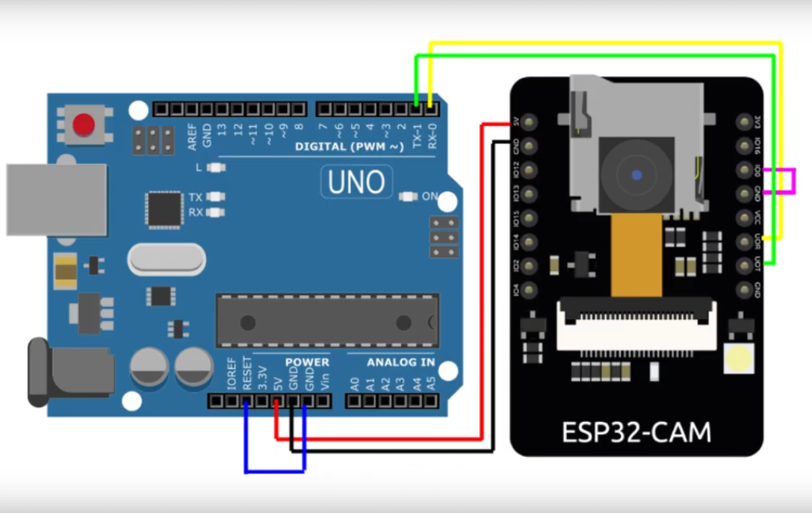
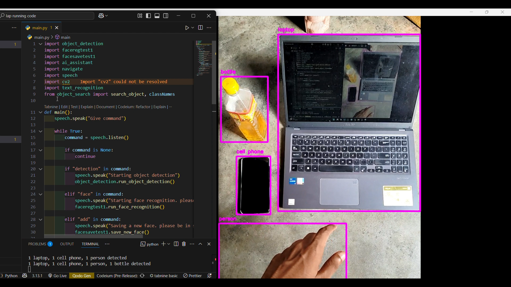

# Blind-Sense : Real-time object detection and audio assistance for visually impaired.

## Overview
**Blind Sense: Real-Time Object Detection and Audio Assistance for Visually Impaired** is an AI-powered assistive system designed to support visually impaired individuals by providing real-time audio feedback about their indoor environment. Utilizing an ESP32 camera module and the YOLO object detection algorithm, the system identifies and announces objects in the user's surroundings.


## Features

- **Voice-Controlled Interface**: Enables hands-free interaction via voice commands.
- **Object Detection**: Detects objects in the camera feed.
- **Face Recognition**: Identifies known individuals in real-time.
- **Add New Face**: Allows registering new faces to the system.
- **AI Chat Assistant**: Offers a voice-driven AI chatbot for queries.
- **Text Recognition (OCR)**: Reads out text detected in the environment.
- **Object Search**: Locates a specific object within the camera frame.
- **Navigation**: Assists in basic navigation with directional support.


## Project Structure

- **/datasets/** – Stores training/testing image data  
- **/models/** – Contains trained models  
- **/utils/** – Utility functions  
- **main.py** – Main entry point for voice-command loop  
- **speech.py** – Handles speech-to-text and text-to-speech  
- **object_detection.py** – Object detection module  
- **face_recognition.py** – Face recognition utilities  
- **faceregtest1.py** – Face recognition runner  
- **facesavetest1.py** – Save new face data  
- **ai_assistant.py** – Voice AI chatbot module  
- **navigate.py** – Navigation support  
- **text_recognition.py** – OCR and text-to-speech module  
- **object_search.py** – Locates specific object in frame  
- **requirements.txt** – Python package dependencies  


## ESP32 and Arduino Connection



## Sample Output




## How to Run

1. **Download Required Files**

Clone the repo and download utils, models and __pycache__ files as zip file from the link below and paste files in respective folders:

[📦 Download files.zip from Google Drive](https://drive.google.com/file/d/16NASGA2nJ4HvKtGVAjmW05p4aVzmnkrF/view?usp=drive_link)


2. **Install Requirements**
   ```bash
   pip install -r requirements.txt

3. **Run the Main Program**
   ```bash
   python main.py

4. **Speak Commands**

  "detection" – Start object detection.

  "face" – Run face recognition.

  "add" – Save a new face.

  "chat" – Activate AI chatbot.

  "read" – Perform OCR to read text.

  "search [object]" – Search for a specific object.

  "navigate" – Start navigation support.

  "exit" – Exit the program.
